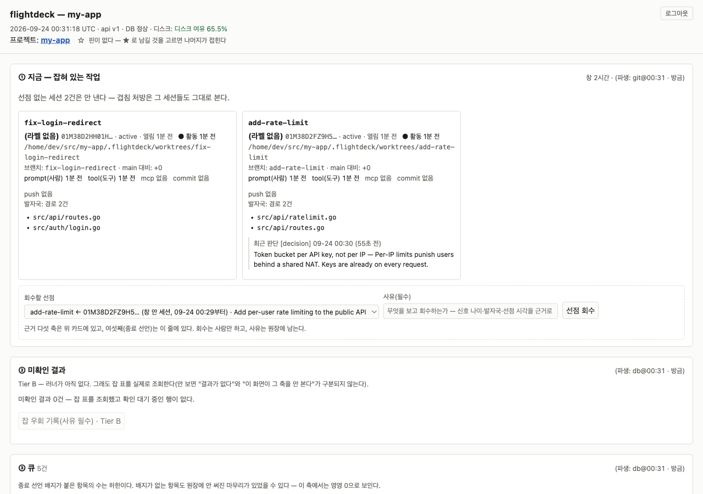

[English](README.md) | **한국어**

# flightdeck

**병렬 에이전트 세션을 위한 조정 계층.** 자체 호스팅 서버 하나에 Claude Code 와 codex 세션이
붙어, 서로가 무엇을 하고 있는지 보면서 일한다.

세션끼리는 대화할 수단이 없다. 그래서 각 세션은 "저쪽이 뭘 집었나"를 추측하고, 추측이 틀리면
남이 하던 일을 통째로 다시 한다. flightdeck 은 그 추측을 없앤다 — 누가 살아 있나 · 어느 경로를
만지나 · 무엇을 집었나를 **git 과 데이터베이스에서 파생해** 모든 세션에 보여 준다.

새 세션을 열면 아무것도 안 쳐도 보드가 먼저 뜬다.

```
보드 · my-app · 2026-08-13 06:40 UTC · 파생 git@06:40:08 최신
잡혀 있는 작업 0건 (선점 기준이다 — 세션의 생사가 아니다)

잡혀 있는 작업이 없다 — 아무 세션도 큐 항목을 쥐고 있지 않다. 서버 장애가 아니다.
창 밖 73건 (가장 오래된 신호 8일 10시간 전) — 창은 표시 구간이지 생존 판정이 아니다
큐 열림 4건
  · 19시간 22분·티클러(08-19 발화) · fd-folded-multi-turn-drain-unmeasured — 다턴 배수가 미실측이다
  · 18시간 41분·티클러(08-26 발화) · fd-lane-turn-remeasure-… — lane-turn 축을 재측한다
랜딩 레인 0건(질의는 돌았다)
```

같은 보드가 <http://localhost:7420> 에 읽기 전용 대시보드로도 뜬다.



<sub>데모 서버에 합성 데이터(`my-app`)를 넣고 찍은 화면이다.</sub>

## 특징

- **락 대신 선점** — `pick` 이 큐 항목을 집으면 그 id 가 그대로 브랜치·워크트리 이름이 된다.
  배타로 쥐는 것은 머지 하나뿐이다.
- **머지 전에 보이는 겹침** — 훅이 편집마다 미커밋 발자국을 보고한다. 두 세션이 같은 경로를
  만지면 턴이 끝날 때 양쪽에 알린다. 막지는 않는다.
- **랜딩 레인** — 머지 앞의 직렬 줄. 차례가 아니면 `fd land` 가 1로 끝나므로
  `fd land && git merge --ff-only "$BRANCH"` 한 줄이 그대로 옳다.
- **항목을 따라다니는 판단** — 왜 그렇게 했나, 무엇을 기각했나, 무엇을 일부러 안 했나를 남기면
  그 항목을 다음에 집는 세션이 전문으로 받는다.
- **적지 않고 파생한다** — 브랜치·HEAD·발자국·활동 신호는 git 과 훅에서 온다. 파생할 수 있는
  사실에는 쓰기 API 가 아예 없다.
- **Claude Code 와 codex 를 한 보드에** — 두 하네스의 세션이 같은 겹침 판정을 받는다.
- **서버가 죽어도 조용하지 않다** — 모든 세션에 배너를 띄우고 되는 것과 안 되는 것을 나눠 말한다.

## 동작 방식

1. **서버** — Go 바이너리 하나(SQLite)를 Docker 로 띄운다. 저장소를 읽기 전용으로 마운트해
   브랜치·커밋·미커밋 변경을 직접 읽는다.
2. **훅** — 세션을 등록하고, 활동 신호와 편집 발자국을 보내고, 턴이 끝날 때 겹침 같은 처방을
   세션에 주입한다.
3. **도구** — 에이전트는 MCP 도구로, 사람은 터미널 `fd` 로 같은 동작을 부른다.
4. **대시보드** — <http://localhost:7420> 에 읽기 전용 보드 한 장.

한 세션의 하루는 이렇게 흐른다.

```
세션 시작      SessionStart 훅이 보드를 주입한다
pick           무엇을 집을지 추천만 한다 (선점하지 않는다)
pick(item_id)  선점 + 항목 본문 + 연결된 판단 + 워크트리 명령
작업           PostToolUse 훅이 편집마다 발자국을 보고한다
finish         판단 + 후속 등록 + 종료 + 반납을 한 트랜잭션으로
land           랜딩 줄에 선다 → 차례가 오면 머지 → land(result: ok)
```

겹침·랜딩 레인·항목 상태·활동 신호의 자세한 모양은 [개념과 동작](docs/concepts.ko.md)에 있다.

## 빠른 시작

필요한 것: **Docker**(서버 머신) · **Go 1.25 이상**(세션을 돌리는 머신 — `bin/fd` 가 첫 호출에
빌드한다) · git.

**1. 서버를 띄운다** — 한 머신에서 한 번.

```bash
git clone https://github.com/Kweiza/flightdeck.git
cd flightdeck
docker compose up -d
curl -s localhost:7420/healthz     # {"ok":true,"api_version":"1","db_ok":true,…}
```

**2. 플러그인을 설치한다** — 세션을 돌리는 머신마다.

```
/plugin marketplace add Kweiza/flightdeck
/plugin install flightdeck@flightdeck
```

**3. 세션을 연다.** 보드가 먼저 뜨면 된 것이다. 일은 `/fd-pickup` 으로 시작한다.

> 1·2 단계는 `/fd-setup` 스킬이 대신 해 준다 — 이 머신이 서버인지 클라이언트인지 묻고,
> 없는 것만 승인받아 설치한다.

- **서버가 다른 머신이면** 세션 쪽에 `FD_URL=http://<서버>:7420` 을 준다(토큰을 쓰면 `FD_TOKEN` 도).
- **도커 없이** 돌리려면 `cd server && go run ./cmd/fd serve --addr :7420 --db ~/.flightdeck/fd.db`.
  컨테이너와 같은 DB 를 가리키므로 **둘을 같이 돌리지 마라.**
- **이미 `flightdeck@kweiza-cc-plugins` 로 깔았다면** 그대로 둬라 — 같은 저장소를 받는다. 둘을 함께 켜지는 마라.

## 쓰는 법

### 세션 안에서 — MCP 도구 10개

외워야 할 것은 넷이다: 집고(`pick`) · 남기고(`note`) · 끝내고(`finish`) · 줄 선다(`land`).

| 도구 | 하는 일 |
|---|---|
| `board` | 지금 누가 무엇을 쥐고 있나 |
| `pick` | 인자 없으면 추천만 한다. `item_id` 를 주면 선점, `leave` 를 주면 반납 |
| `note` | 판단을 남긴다 — `decision` `handoff` `blocked` `ask` `rejected` `not-done` `verified` `draft` |
| `add` | 큐 항목을 만든다. id 가 그대로 브랜치 이름이 된다 |
| `finish` | 판단 + 후속 등록 + 종료 + 반납을 한 트랜잭션으로 |
| `land` | 랜딩 레인(또는 이름 붙인 자원)의 줄에 선다 / 보고하고 반납한다 |
| `alloc` | 원자 발번 — 개정 차수 같은 논리 카운터 |
| `label` | 표시용 꼬리표 |
| `amend` | 항목의 제목·본문·경로를 고친다. 옛 값은 개정 이력에 남는다 |
| `show` | 항목 하나를 읽는다 — 닫힌 항목도 된다 |

### 터미널에서 — `fd`

```bash
fd status                         # 서버 상태 배너 + 보드
fd next                           # 추천만
fd pick <item-id>                 # 선점
fd finish <item-id> --outcome done --body "왜 · 기각한 것 · 안 한 것 · 확인한 것"
fd land && git merge --ff-only "$BRANCH"
fd doctor                         # 이 머신과 서버의 상태를 실제로 잰다
```

### 스킬 4개

| 스킬 | 언제 |
|---|---|
| `/fd-setup` | 머신을 처음 켤 때 — 서버/클라이언트를 정하고 필요한 것만 설치·기동 |
| `/fd-pickup` | 세션을 시작할 때 — 보드 → 추천 → 선점 → 연결된 판단 읽기 |
| `/fd-handoff` | 작업을 마칠 때 — 판단·후속·종료·반납을 한 호출로 |
| `/fd-update` | 서버·플러그인·DB 를 최신으로 |

파라미터 전체와 쓰는 규율은 [도구 레퍼런스](docs/reference.ko.md)에 있다.

## codex

```bash
fd setup --install-codex   # ~/.local/bin/fd-hook · ~/.local/bin/fd · ~/.codex/hooks.json
codex                      # 한 번은 TUI 로 띄워 "Hooks need review" 를 승인한다
```

- **승인 전에는 훅이 아무 말 없이 안 돈다.** 확인은 `fd doctor` 의 codex 절로 한다.
- codex 기본 샌드박스는 네트워크를 끊는다 — `codex -c sandbox_workspace_write.network_access=true`.
- `~/.local/bin` 을 PATH 에 넣는다. codex 에는 MCP 도구가 없고 터미널 `fd` 를 쓴다.

왜 그렇게 생겼는지와 되는 것·안 되는 것의 전체 표는 [codex 에서 쓰기](docs/codex.ko.md)에 있다.

## 설정

서버는 compose 가 읽는 환경 변수로, 세션은 `fd setup` 이 쓰는 `~/.flightdeck/config.json` 이나
환경 변수로 설정한다.

| 변수 | 쪽 | 뜻 |
|---|---|---|
| `FD_TOKEN` | 서버 · 세션 | 인증 토큰. 안 주면 인증 없이 뜨고 `/healthz` 가 그 사실을 알린다 |
| `FD_REPOS` | 서버 | 저장소가 있는 자리(기본 `$HOME`). 파생의 전부가 여기서 나온다 — **갱신할 때 잃지 마라** |
| `FD_REPOS2`–`FD_REPOS4` | 서버 | 저장소가 여러 트리에 흩어져 있을 때 추가 마운트 |
| `FD_UID` · `FD_GID` | 서버 | 호스트 사용자 id(기본 1000) |
| `FD_LEDGER_HOST` | 서버 | 원장 백업 자리(기본 `~/.flightdeck-ledger`) |
| `FD_URL` | 세션 | 서버 주소(기본 `http://127.0.0.1:7420`) |
| `FD_STATE_DIR` | 세션 | 상태 파일(아웃박스·캐시·머신 id)을 한 자리로 모은다 |
| `FD_LANG` | 서버 · 세션 | 출력 언어. `en` 이면 영어로 낸다(기본 한국어). 서버 쪽은 대시보드, 세션 쪽은 CLI·훅·MCP 결과다 |

각 변수의 함정과 이유는 [서버 운영](docs/server.ko.md)에 있다.

`FD_LANG=en` 은 **출력 경계에서** 옮긴다 — 보드, 대시보드, add·next·pick·note·finish·show, land,
꼬리, Stop 처방이 1차 범위다. 번역표(`server/internal/lang/catalog.go`)에 없는 줄은 **줄째 한국어로**
남는다(반쪽 번역을 안 낸다). `fd doctor`·로그인 화면·드문 진단 문구는 아직 한국어다.

## 여러 저장소

한 제품이 저장소 여럿으로 갈리면 루트 폴더에 `.flightdeck.yaml` 로 멤버를 선언하고 루트에서 한 번만
띄워 전부를 관장한다. 절차는 [여러 저장소](docs/workspaces.ko.md)에 있다.

## 서버가 죽으면

`SessionStart` 가 배너를 주입한다 — 조정 기구가 있는 줄 알고 움직이는 에이전트가 없도록.

```
⚠ 조정 서버 미도달(http://localhost:7420, 마지막 접속 14:02 · 37분 전).
  되는 것: 코드 작성·커밋·조사 전부. 이미 선점한 항목의 작업.
  안 되는 것: 새 항목 선점 · 다른 세션의 현재 상태.
```

읽기는 마지막 스냅숏을 낡음 표시와 함께 내고, 판단·노트는 쌓였다가 재연결 때 재생된다. 선점·발번·
랜딩 레인은 거절된다 — 오프라인에서 허용하면 배타가 거짓이 된다.

## 문제 해결

먼저 `fd doctor` 를 돌려라. 플랫폼 축과 서버 상태를 하나씩 이름으로 낸다.

| 증상 | 볼 곳 |
|---|---|
| 보드가 비어 있다 | 아무도 항목을 안 쥐었으면 그것이 정상이다. 이상하면 `fd doctor` 의 `FD_URL` 부터 |
| 훅이 아무것도 안 한다 | `bin/fd` 를 직접 돌려 본다 — Go 가 없으면 안내가 나온다 |
| 도구가 안 보인다 | `.mcp.json` 의 `type` 이 `stdio` 인가 |
| 보드에 `브랜치 ?(못 읽음)` | 서버 컨테이너에 저장소가 안 마운트됐다(`FD_REPOS`) |
| codex 에서 카드가 안 뜬다 | 훅 승인 전이다 — `codex` TUI 를 한 번 띄운다 |

## 설계 원칙

1. **파생 가능한 사실에는 쓰기 API 를 만들지 않는다.** 검사가 아니라 부재로 강제한다.
2. **세션이 외워야 할 개념 수를 늘리지 않는다.** 도구가 늘면 핸드오프·후속 등록 같은 뒤쪽 규율이 먼저 빠진다.
3. **정합성은 REST, MCP 는 그 위의 얇은 껍데기.** 둘 다 같은 함수를 부른다.

그리고 **생존 판정 불리언이 없다.** "저 세션 살아 있나"에 예/아니오로 답하지 않고 신호별 나이만 낸다 —
그 판정이 실측에서 두 번 틀렸기 때문이다. 이유와 안 만든 것의 목록은 [개념과 동작](docs/concepts.ko.md)과
설계 정본 [DESIGN.md](DESIGN.md)에 있다.

## 실제 운영

2026년 8월 운영 원장에서, 한 머신의 **세션 24개가 10분 창 안에 동시에** 신호를 냈고 그중 22개가
같은 두 저장소를 만지고 있었다. 첫 열흘 동안 겹침 처방이 601건 나갔고 랜딩 줄서기는 두 저장소 합쳐
157회였다. 수치와 그 한계는 [실측 기록](docs/field-notes.ko.md)에 있다.

## 개발

저장소 루트가 곧 플러그인 루트다. 서버·CLI·MCP·훅은 `server/` 의 Go 모듈 하나에서 나온다.

```bash
cd server
gofmt -l .                                            # 빈 출력
go vet ./... && GOOS=linux go vet ./... && GOOS=windows go vet ./...
go test ./...                                         # 수 분 걸린다
```

코드가 바뀐 push 는 `.claude-plugin/plugin.json` 의 `version` 을 같이 올린다 — 안 올리면
`/plugin update` 가 새 코드를 안 가져온다. 구성과 관문의 자세한 이유는 [개발](docs/development.ko.md)에 있다.

## 출처

flightdeck 은 플러그인 모음 [kweiza-cc-plugins](https://github.com/Kweiza/kweiza-cc-plugins) 의
`plugins/flightdeck` 에서 자랐고 2026-09-24 에 0.38.3 을 기준으로 여기로 분리됐다. 그전의 이력과,
문서·코드 주석이 인용하는 커밋 sha 는 그 저장소에 있다.

## 라이선스

MIT — [LICENSE](LICENSE) 를 보라.
