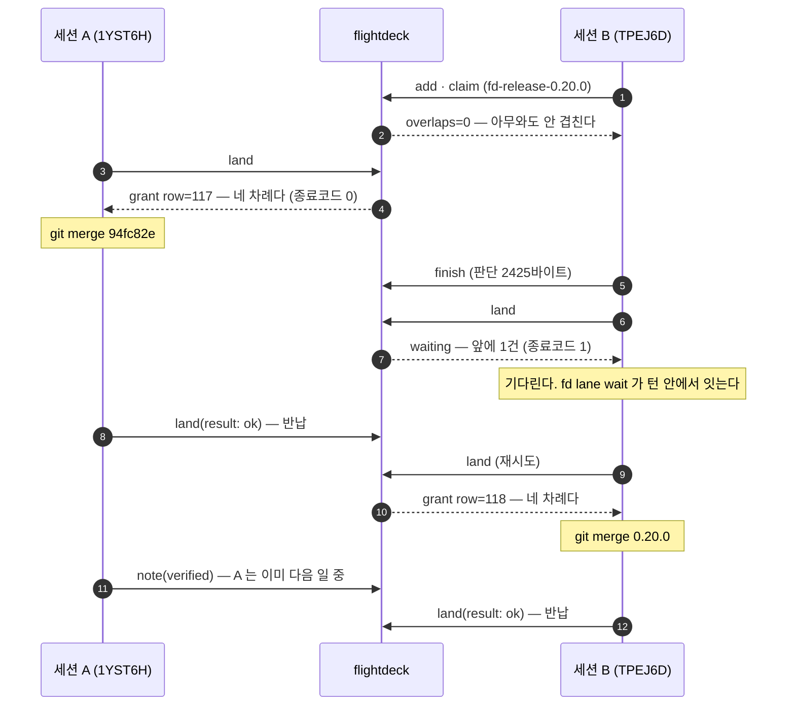
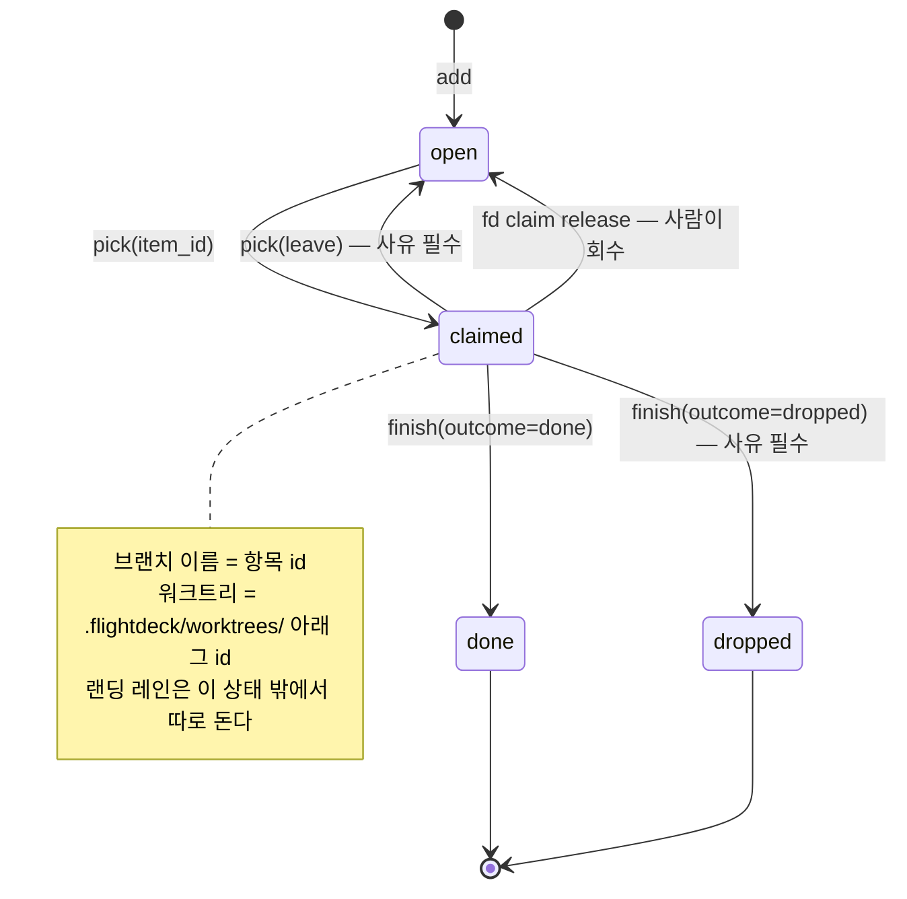

[English](concepts.md) | **한국어**

# 개념과 동작

왜 이런 도구가 필요한지, 병렬 세션이 실제로 어떻게 굴러가는지, 그리고 설계가 지키는 원칙을 적는다.

[← README](../README.ko.md)

---

## 왜 필요한가

한 사람이 Claude Code 세션을 10개 넘게 병렬로 돌려 한 제품을 개발하면, 세션끼리 대화할
수단이 없어 "저쪽이 뭘 집었나"를 추측하게 된다. 그 추측이 틀리면 남의 작업을 통째로 집는
사고가 난다.

흔한 처방은 레포마다 셸 스크립트 네 벌(게시판·큐·핸드오프·대시보드)과 배타 락 다섯 종이다.
그 구조를 8축으로 실측했더니 병목이 이렇게 나왔다 — **세션 수 N 에 대해 악화하는 순서다.**

| # | 병목 | 무엇이 문제였나 |
|---|---|---|
| 1 | 대시보드 | 조정 산출물 중 유일하게 공유되는 것이라 전 세션이 2회씩 편집한다(수요 = 2N). 배타 단위가 카드 한 장이 아니라 **파일 전체**이고, 모든 커밋이 `asOf` 한 줄을 건드려 리베이스가 반드시 충돌한다 |
| 2 | 랜딩 락 | 검증 11단계 중 이미지 태그를 쓰는 것은 4단계뿐인데 **전 구간이 잠긴다** |
| 3 | 큐 착수 경로 | 1차 필터가 죽어 있고, 그 값의 출처가 브랜치 diff 라 **규율을 지킨 착수 직후 세션에는 정의상 비어 있다** |
| 4 | 수동 호출 | 세션당 20회 넘게 손으로 불러야 하는데 자동 강제 지점이 둘뿐이고, **안 불렀다는 사실조차 안 남는다** |
| 5 | 계약 락 | 세션 발자국의 절반만 덮고, 실제로 난 사고(같은 날 개정 차수 충돌)는 **락이 원리적으로 못 지키는** 논리 카운터였다 |
| 6 | 스테이징 락 | 자동 반납이 없고, 갱신을 안 해 **긴 세션이 남에게 죽은 것으로 보인다** |
| 7 | 게시판 조회 | 파일이 안 지워져 신호 대 소음이 단조 악화한다(실측 6%) |

뿌리는 하나로 모인다. **파생 가능한 사실을 손으로 다시 적는다.** 누가 살아 있나 · 무엇이
랜딩됐나 · 어느 경로를 건드리나 · HEAD 가 무엇인가는 전부 git 과 파일시스템에 이미 있다.
손으로 베낀 스냅숏은 원본이 움직이는 순간 조용히 거짓이 되고, **거짓임을 알려 주는 자리가 없다.**

flightdeck 은 그 자리들을 지운다. 파생할 수 있는 것에는 **쓰기 API 파라미터를 아예 안 만든다** —
틀리게 적을 필드가 없으면 검사할 것도 우회할 것도 없다.

---

## 병렬 세션은 이렇게 굴러간다

### ① 한 세션의 하루

```
세션이 열린다  →  SessionStart 훅이 보드를 주입한다 (아무것도 안 쳐도 뜬다)
      ↓
pick           →  "무엇을 집을까"를 추천만 한다. 아직 선점하지 않는다
      ↓
pick(item_id)  →  선점 + 항목 본문 + 연결된 판단 전문 + 브랜치·워크트리 명령
      ↓
워크트리에서 작업  →  PostToolUse 훅이 편집할 때마다 미커밋 발자국을 보고한다
      ↓
finish         →  판단 + 후속 등록 + 항목 종료 + 자원 반납이 한 호출·한 트랜잭션
      ↓
land           →  랜딩 줄에 선다. 내 차례면 종료코드 0, 아니면 1
      ↓
머지하고 land(result: ok)  →  레인 반납. 다음 세션이 들어온다
```

핵심은 **`pick` 이 두 단계라는 것**이다. 인자 없이 부르면 추천과 **탈락 사유 전부**를 내고
선점하지 않는다. 그래서 "뭘 집을지 보기"가 남의 후보를 뺏지 않는다.

### ② 두 세션이 같은 파일을 만지면 — 겹침

락을 걸지 않는다. **알린다.** 그리고 거르지 않는다.

편집할 때마다 `PostToolUse` 훅이 미커밋 발자국을 서버에 보낸다. 다른 세션의 발자국과
경로가 겹치면, 턴이 끝날 때 `Stop` 훅이 처방을 물어 화면에 주입한다.

원장에 실제로 남은 처방이다(2026-08-13):

```json
{
  "key": "overlap:01KZWPMRGEEX81D8VFKTJ9MKHJ",
  "reason": "이번에 만진 CLAUDE.md 가 세션 01KZWPMRGEEX81D8VFKTJ9MKHJ 의
             발자국 CLAUDE.md 와 겹친다(겹친 쌍 1)",
  "sibling_claims": ["ddl-backfill-createdat-signal-comment-misleading",
                     "mcp-server-exchange-opaque-token-hole", … 9건],
  "workspace_claims": ["mcp-server-exchange-opaque-token-hole"]
}
```

여기서 중요한 것은 **막지 않는다**는 점이다. 겹침은 사고가 아니라 정보다 — 한 줄 순삽입과
47줄 개정이 같은 무게로 뜨면 안 되므로 규모(`+증가/-감소`)를 함께 내고 큰 것부터 세운다.
**못 잰 것은 0 이 아니라 `(규모?)` 로 낸다.**

그리고 `pick` 은 겹침을 **거르지 않고 명시한다**:

```
겹침 판정 범위: 항목 fd-… 의 경로만 봤다 — 이 응답이 합친 경로는 그것뿐이다.
겹침: 없음 — 살아 있는 세션 어느 것과도 경로가 안 겹친다.
```

침묵하면 "겹침 없음"과 "이 축을 안 본다"가 구분되지 않는다. 그래서 **안 본 축도 말한다.**

### ③ 두 세션이 동시에 머지하려 하면 — 랜딩 레인

여기만 진짜 배타다. 나머지는 전부 알림이다.

아래는 **원장에 남은 실제 이벤트**다(2026-08-12, 개발 저장소, 세션 id 끝 6자리로 표기):

```
14:08:14.889  TPEJ6D  item.add      fd-release-0.20.0
14:08:20.806  TPEJ6D  item.claim    overlaps=0  outside=0  paths=1
14:08:56.771  1YST6H  lane.land     mode=acquire
14:08:56.773  1YST6H  lane.grant    row=117          ← A 가 2ms 만에 차례를 받는다
14:11:39.384  TPEJ6D  item.finish   판단 2425바이트
14:11:42.119  TPEJ6D  lane.land     mode=acquire     ← B 가 줄을 선다. grant 가 안 온다
14:11:43.187  1YST6H  lane.report   mode=ok          ← A 가 머지를 끝내고 반납
14:11:51.975  TPEJ6D  lane.land     mode=acquire
14:11:51.979  TPEJ6D  lane.grant    row=118          ← B 가 차례를 받는다
14:12:16.564  1YST6H  judgment.note verified          ← A 는 기다리지 않고 다음 일로 갔다
14:14:33.211  TPEJ6D  lane.report   mode=ok
```

두 줄행이 실제로 무엇이었는지도 원장에 있다:

- `#117` — `94fc82e (merge) ← 8a14eaf`. "event.kind 10종"이라 적힌 거짓을 전수(33종)로 정정
- `#118` — `0.20.0 릴리스 머지`. plugin.json 한 줄. 머지 후 main 에서 gofmt·vet 무출력, 13개 패키지 ok

시간순으로 그리면 이렇다.



**`fd land` 의 종료코드가 답하는 질문은 "요청이 성공했나"가 아니라 "지금 랜딩해도 되는가"** 다.
그래서 이 한 줄이 그대로 성립한다:

```bash
fd land && git merge --ff-only "$BRANCH"
```

`turn`·`released`·`left` 만 0 이고 `waiting`·`reclaimed`·모르는 상태는 전부 1 이다 —
대기에 0 을 내면 그 한 줄이 배타를 통째로 우회하는데 서버는 내내 옳고 아무 로그도 안 남는다.

### ④ 항목은 이 길을 돈다



전이마다 도구가 하나씩 붙는다.

| 전이 | 도구 | 무엇이 함께 일어나나 |
|---|---|---|
| `→ open` | `add` | 항목 id 가 **그대로 브랜치 이름**이 된다. 전역 유일이라 브랜치 충돌이 구조적으로 소멸한다 |
| `open → claimed` | `pick(item_id)` | 선점 + 연결된 판단 전문 + 겹침 + 워크트리 명령이 한 응답에 온다 |
| `claimed → open` | `pick(leave:)` | **id 와 이력이 산다.** `finish(dropped)` 로 때우면 id 가 바뀌어 이력이 끊긴다 |
| `claimed → done` | `finish` | 판단·후속 등록·종료·반납이 **한 트랜잭션**. 중간에 실패하면 통째로 롤백된다 |
| (언제든) | `note` | 파생 불가능한 유일한 자산 — 왜 그렇게 했나, 무엇을 기각했나, **일부러 안 한 것** |
| (랜딩 시) | `land` | 항목 상태와 무관하게 도는 별도 줄. 자원 이름을 주면 그 자원의 줄에 선다 |

### ⑤ "저 세션 살아 있나"에는 답하지 않는다

이 도구에는 **생존 판정 불리언이 없다.** 만드는 순간 그것이 회수·회피·탈락 셋의 상류가 되기
때문이다. 그 판정은 실측에서 두 번 틀렸다 — 죽었다고 판정한 세션이 그 뒤 **6커밋을 랜딩했고**,
419분 무갱신으로 표시된 세션이 실제로는 **17초 전에 살아 있었다.**

대신 신호 넷을 **나란히** 낸다. 합치지 않는다.

| kind | 언제 찍히나 | 무슨 뜻인가 |
|---|---|---|
| `prompt` | `UserPromptSubmit` | 사람이 지금 몰고 있다 — 가장 강한 신호 |
| `tool` | `PostToolUse(Edit\|Write)` | 에이전트가 일하고 있다(사람이 자리를 비워도) |
| `mcp` | MCP 도구 호출 | 세션이 살아 있다 — 일하고 있다는 뜻은 **아니다** |
| `commit`·`push` | 서버의 git 리더가 직접 관측 | **클라이언트를 안 믿는 유일한 신호** |

`prompt` 와 `tool` 을 가른 이유가 있다. 에이전트가 20분짜리 도구를 돌리는 동안 `prompt` 는
안 오지만 `tool` 은 온다. 반대로 사람이 읽기만 하는 동안은 `prompt` 만 온다.
**하나만 보면 둘 중 한 상황을 반드시 오판한다.**

그래서 화면은 **"죽었다"고 쓰지 않고 나이를 숫자로만 낸다.** 회수가 필요하면 사람이,
사유와 함께, 근거 여섯 축을 나란히 본 뒤에 한다.

> **★ 반드시 알아야 하는 한계** — 창을 닫고 나간 세션·`tmux kill`·SIGKILL 은 종료 경로를
> 안 지난다(플랫폼이 프로세스 종료를 안 알려 준다). 그 카드는 창(기본 2시간)으로만 사라진다.
> 실측: 보드가 카드 26장을 냈을 때 `/proc` 으로 잰 살아 있는 프로세스는 **5개**였다.
> 이 한계를 모르면 "닫히니까 카드는 항상 정확하다"고 믿게 되고, 그 믿음이 위의 두 오판을 다시 만든다.

---

## 설계 원칙 셋

충돌하면 위가 이긴다.

1. **파생 가능한 사실에는 쓰기 API 파라미터를 만들지 않는다.** 검사가 아니라 **부재**로
   강제한다. `--force` 도 `SKIP=1` 도 그 축에는 존재할 수 없다 — 우회할 필드가 없으므로.
2. **세션이 외워야 할 개념 수를 늘리는 기능은 만들지 않는다.** 성공 지표는 세션당 쓰기 호출 수와
   대체되는 규율 산문의 분량이다. 도구가 늘면 규율의 뒤쪽(핸드오프·후속 등록·해제)이 먼저 빠진다.
3. **정합성 경로는 REST, MCP 는 그 위의 얇은 껍데기.** 둘 다 같은 순수 함수를 부른다. 두 벌이 아니다.

### 안 만든 것

머지 큐·러너(Tier B) · 이벤트 소싱 · 표류 자동 탐지기 · RBAC · 선점의 오프라인 재생 ·
**생존 판정 불리언**. 각각의 이유는 [`DESIGN.md`](../DESIGN.md) §11 에 있다.

> Tier B 를 안 만든 흔적이 원장에 그대로 있다 — `job` 표는 **0행**이고,
> `item.landed_ref` 는 1,073행이 **전부 NULL** 이다. 그 칸은 "러너가 실제로 fast-forward 한
> sha"만 받는데 Tier A 에는 러너가 없다. 그래서 랜딩 수는 `landed_ref` 가 아니라
> `landing_queue.left_kind='ok'` 로 센다.
