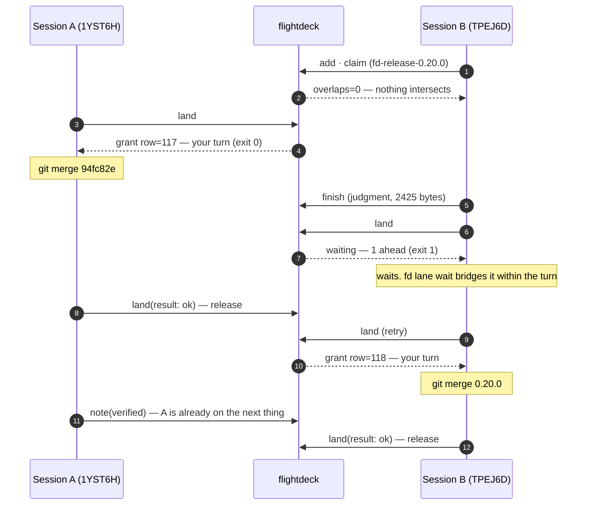
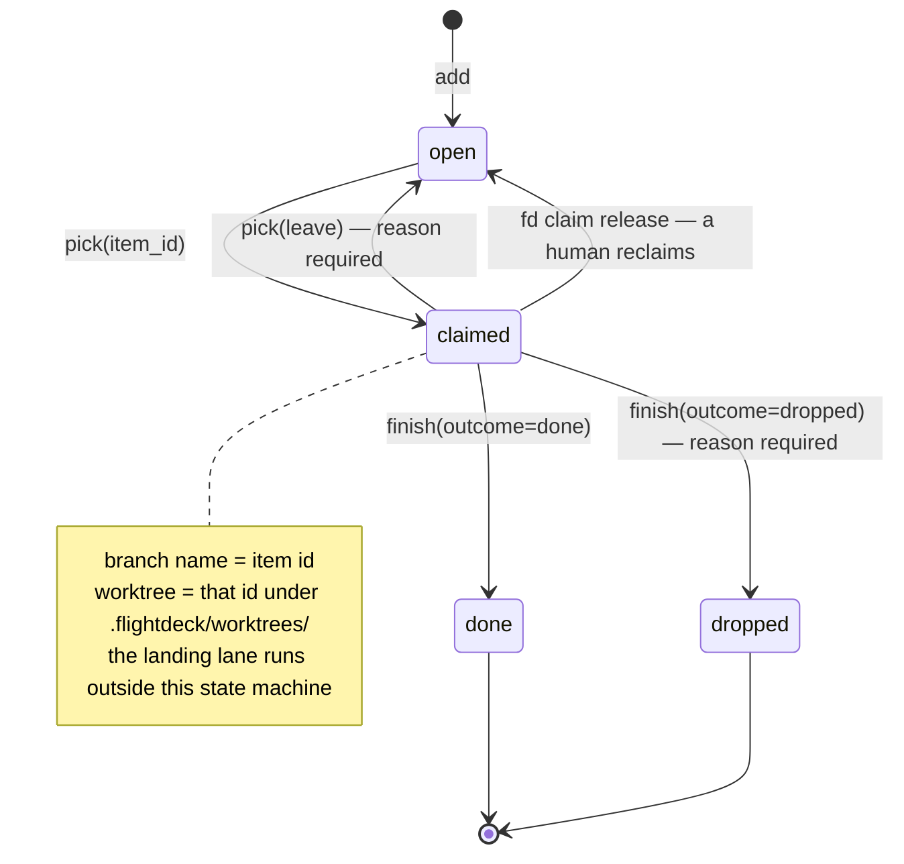

**English** | [한국어](concepts.ko.md)

# Concepts

Why a tool like this is needed, how parallel sessions actually run, and the principles the design holds to.

[← README](../README.md)

---

## Why this exists

When one person runs more than ten Claude Code sessions in parallel on a single product, the
sessions cannot talk to each other, so each one guesses what the others picked up. When that guess
is wrong, a session takes over another session's work wholesale.

The common remedy is four shell scripts per repo (board, queue, handoff, dashboard) plus five kinds
of exclusive lock. Measuring that structure along 8 axes produced this — **ordered by how badly each
degrades as the session count N grows.**

| # | Bottleneck | What was actually wrong |
|---|---|---|
| 1 | Dashboard | The only shared coordination artifact, so every session edits it twice (demand = 2N). The unit of exclusion is **the whole file**, not one card, and every commit touches the `asOf` line, so a rebase conflict is guaranteed |
| 2 | Landing lock | Only 4 of 11 verification steps use the image tag, yet **the entire range is locked** |
| 3 | Queue entry path | The first-pass filter was dead, and its input came from a branch diff — which is **by definition empty for a session that just followed the discipline and started clean** |
| 4 | Manual calls | Over 20 per session, only two automatic enforcement points, and **no record that a call was skipped** |
| 5 | Contract lock | Covers only half of a session's footprint, and the accident that actually happened (same-day revision-number collision) was a logical counter **a lock cannot protect in principle** |
| 6 | Staging lock | No automatic release, and it never refreshed its own timestamp, so **a long session looks dead to everyone else** |
| 7 | Board reads | Files are never deleted, so signal-to-noise degrades monotonically (measured: 6%) |

The roots converge on one. **Facts that could be derived are re-typed by hand.** Who is alive, what
landed, which paths are being touched, what HEAD is — all of it is already in git and the filesystem.
A hand-copied snapshot becomes quietly false the moment the original moves, and **nothing tells you
it went false.**

flightdeck deletes those places. For anything derivable there is **no write-API parameter at all** —
if there is no field to fill in wrongly, there is nothing to validate and nothing to bypass.

---

## How parallel sessions actually run

### 1. One session's day

```
session opens   →  SessionStart hook injects the board (no command needed)
      ↓
pick            →  recommends what to take. ★ does NOT claim
      ↓
pick(item_id)   →  claim + item body + every linked judgment + branch/worktree commands
      ↓
work in worktree → PostToolUse hook reports uncommitted footprints on every edit
      ↓
finish          →  judgment + followups + close item + release, one call, one transaction
      ↓
land            →  join the landing queue. Exit 0 if it is your turn, 1 if not
      ↓
merge, land(ok) →  release the lane. The next session comes in
```

The key is that **`pick` has two stages**. Called with no arguments it returns a recommendation and
**every rejection reason**, and claims nothing. So "look at what I could take" never steals anyone
else's candidate.

### 2. When two sessions touch the same file — overlap

It does not lock. **It tells you.** And it does not filter.

On every edit the `PostToolUse` hook sends uncommitted footprints to the server. When paths overlap
with another session's footprint, the `Stop` hook asks for a prescription at end of turn and injects
it into the transcript.

An actual prescription from the ledger (2026-08-13):

```json
{
  "key": "overlap:01KZWPMRGEEX81D8VFKTJ9MKHJ",
  "reason": "이번에 만진 CLAUDE.md 가 세션 01KZWPMRGEEX81D8VFKTJ9MKHJ 의
             발자국 CLAUDE.md 와 겹친다(겹친 쌍 1)",
  "sibling_claims": ["ddl-backfill-createdat-signal-comment-misleading",
                     "mcp-server-exchange-opaque-token-hole", … 9 more],
  "workspace_claims": ["mcp-server-exchange-opaque-token-hole"]
}
```

*"The `CLAUDE.md` you just touched overlaps with session 01KZWPMR…'s footprint `CLAUDE.md`
(1 overlapping pair)."*

What matters is that **it does not block**. An overlap is information, not an accident — and since a
one-line insertion and a 47-line rewrite must not carry equal weight, the size (`+added/-removed`) is
reported alongside and the largest go first. **What could not be measured is reported as `(규모?)`
("size?"), never as 0.**

`pick` also **states overlaps instead of filtering them out**:

```
겹침 판정 범위: 항목 fd-… 의 경로만 봤다 — 이 응답이 합친 경로는 그것뿐이다.
겹침: 없음 — 살아 있는 세션 어느 것과도 경로가 안 겹친다.
```

*"Overlap scope: only the paths of item fd-… were examined — those are the only paths this response
combined. / Overlap: none — no live session's paths intersect."*

Stay silent and "no overlap" becomes indistinguishable from "this axis was never examined." So
**the axis it did not look at is stated too.**

### 3. When two sessions merge at once — the landing lane

This is the only real exclusion. Everything else is notification.

Below are **actual events from the ledger** (2026-08-12, the development repo, sessions shown by the last 6
characters of their id):

```
14:08:14.889  TPEJ6D  item.add      fd-release-0.20.0
14:08:20.806  TPEJ6D  item.claim    overlaps=0  outside=0  paths=1
14:08:56.771  1YST6H  lane.land     mode=acquire
14:08:56.773  1YST6H  lane.grant    row=117          ← A gets its turn 2 ms later
14:11:39.384  TPEJ6D  item.finish   judgment, 2425 bytes
14:11:42.119  TPEJ6D  lane.land     mode=acquire     ← B queues. No grant comes
14:11:43.187  1YST6H  lane.report   mode=ok          ← A finishes its merge and releases
14:11:51.975  TPEJ6D  lane.land     mode=acquire
14:11:51.979  TPEJ6D  lane.grant    row=118          ← B gets its turn
14:12:16.564  1YST6H  judgment.note verified         ← A did not wait; it moved on
14:14:33.211  TPEJ6D  lane.report   mode=ok
```

The ledger even records what those two queue rows were:

- `#117` — `94fc82e (merge) ← 8a14eaf`. Correcting a false claim of "event.kind: 10 kinds" to the full count (33)
- `#118` — the `0.20.0` release merge. One line in plugin.json. After merging, `gofmt`/`vet` silent on main, 13 packages ok

Drawn in time order:



**The question `fd land`'s exit code answers is not "did the request succeed" but "may I land right
now."** That is what makes this one-liner correct:

```bash
fd land && git merge --ff-only "$BRANCH"
```

Only `turn`, `released` and `left` exit 0; `waiting`, `reclaimed` and any unknown state all exit 1 —
because returning 0 while waiting would let that single line bypass exclusion entirely, with the
server correct the whole time and nothing in any log.

### 4. The path an item travels



Each transition has exactly one tool.

| Transition | Tool | What else happens |
|---|---|---|
| `→ open` | `add` | The item id **becomes the branch name**. It is globally unique, so branch-name collisions disappear structurally |
| `open → claimed` | `pick(item_id)` | Claim + every linked judgment + overlaps + worktree commands, in one response |
| `claimed → open` | `pick(leave:)` | **The id and its history survive.** Papering over it with `finish(dropped)` changes the id and severs the history |
| `claimed → done` | `finish` | Judgment, followups, close and release in **one transaction**. A failure midway rolls back all of it |
| (any time) | `note` | The one asset that cannot be derived — why you did it, what you rejected, **what you deliberately did not do** |
| (at landing) | `land` | A separate queue that runs independently of item state. Name a resource and you queue for that resource |

### 5. It refuses to answer "is that session alive?"

There is **no liveness boolean** in this tool. The moment you create one it becomes the upstream of
reclaiming, avoidance and exclusion. That judgment was measured wrong twice — a session declared dead
**landed 6 commits afterwards**, and a session shown as 419 minutes idle was in fact
**alive 17 seconds ago**.

Instead four signals are reported **side by side**. They are never merged.

| kind | When it fires | What it means |
|---|---|---|
| `prompt` | `UserPromptSubmit` | A human is driving right now — the strongest signal |
| `tool` | `PostToolUse(Edit\|Write)` | The agent is working (even with nobody at the keyboard) |
| `mcp` | An MCP tool call | The session is alive — **not** that it is working |
| `commit`·`push` | Observed directly by the server's git reader | **The only signal that does not trust the client** |

There is a reason `prompt` and `tool` are kept apart. While an agent runs a 20-minute tool, `prompt`
stops arriving but `tool` keeps coming. While a human only reads, only `prompt` arrives.
**Watch just one and you will necessarily misread one of those two situations.**

So the screen **never writes "dead" — it prints an age as a number.** When a reclaim is needed a
human does it, with a stated reason, after seeing six axes of evidence side by side.

> **★ A limit you must know** — a session whose window was closed, `tmux kill`, or SIGKILL never
> passes through the close path (the platform does not announce process exit). Those cards disappear
> only by the window (2 hours by default). Measured: when the board showed 26 cards, the live
> `claude` processes counted through `/proc` were **5**.
> Not knowing this leads to believing "cards are always accurate because they get closed," and that
> belief is exactly what produced the two misjudgments above.

---

## Three design principles

When they conflict, the higher one wins.

1. **No write-API parameter for anything derivable.** Enforced by **absence**, not validation. Neither
   `--force` nor `SKIP=1` can exist on that axis, because there is no field to bypass.
2. **No feature that increases the number of concepts a session must memorize.** The success metrics
   are writes per session and how much prose discipline gets replaced. Add tools and the tail of the
   discipline (handoff, followup registration, release) is what drops first.
3. **REST is the consistency path; MCP is a thin shell over it.** Both call the same pure functions.
   They are not two implementations.

### What was deliberately not built

A merge queue and runner (Tier B) · event sourcing · an automatic drift detector · RBAC · offline
replay of claims · **a liveness boolean**. Each reason is in [`DESIGN.md`](../DESIGN.md) §11.

> The evidence for not building Tier B is in the ledger itself — the `job` table has **0 rows**, and
> all 1,073 rows of `item.landed_ref` are **NULL**. That column only accepts "the sha a runner actually
> fast-forwarded," and Tier A has no runner. So landings are counted from
> `landing_queue.left_kind='ok'`, not from `landed_ref`.
